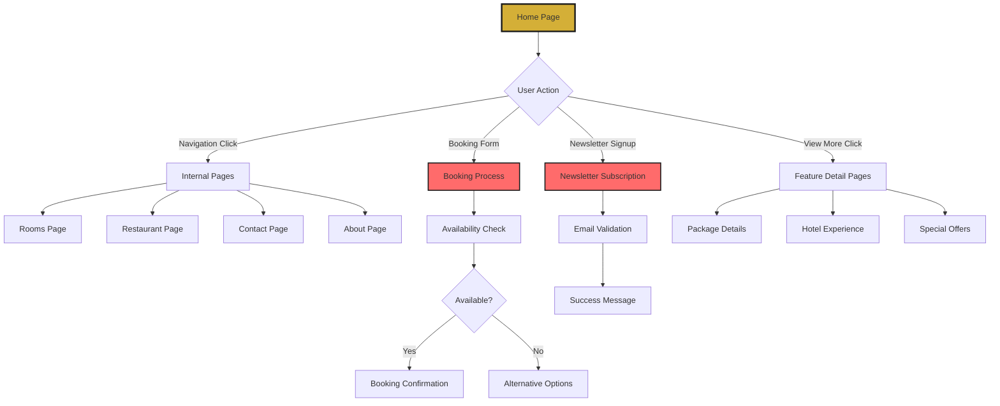
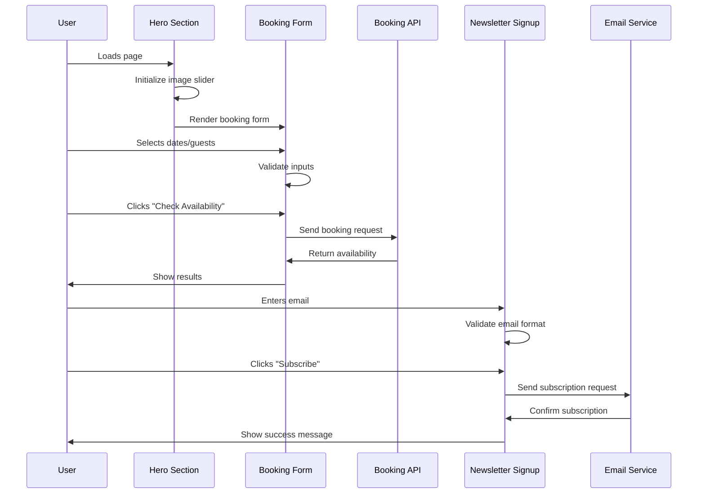

# Stradella Hotel Website Architecture Plan
**NextJS + TailwindCSS Implementation Guide**

## 1. Overall Layout Structure & Component Hierarchy

### Page Layout Analysis
The Stradella Hotel website follows a classic luxury hotel layout with the following main sections:

```
├── Header
│   ├── Top Contact Bar
│   │   ├── Contact Info (Left)
│   │   └── Location & Email (Right)
│   └── Main Navigation
│       ├── Centered Logo
│       └── Navigation Menu
├── Hero Section
│   ├── Image Slider/Background
│   ├── Overlay Content
│   │   ├── Hero Text
│   │   └── Booking Form
├── Features Section
│   ├── Featured Package
│   ├── Experience Stradella Hotel
│   └── Special Offers
├── Testimonial Section
│   ├── Logo
│   └── Quote Text
└── Footer
    ├── Newsletter Signup
    └── Contact Information
```

### Component Hierarchy Breakdown

#### 1. Header Component (`components/Header.tsx`)
- **Top Contact Bar**: Responsive strip with contact details
  - Left: Phone number with icon
  - Right: Location and email
- **Main Navigation**: Centered logo with horizontal menu
  - Logo: Stradella Hotel branding (circular design)
  - Menu Items: HOME, ROOMS, MEETING AND EVENTS, PROMOS, PHOTOS, ABOUT US, RESTAURANT, CONTACT US


## Component Hierarchy Diagram

```mermaid
graph TD
    A[App Layout] --> B[Header]
    A --> C[Main Content]
    A --> D[Footer]
    
    B --> E[Top Contact Bar]
    B --> F[Main Navigation]
    
    E --> G[Contact Info]
    E --> H[Location & Email]
    
    F --> I[Logo]
    F --> J[Navigation Menu]
    
    C --> K[Hero Section]
    C --> L[Features Section]
    C --> M[Testimonial Section]
    
    K --> N[Background Image/Slider]
    K --> O[Hero Content]
    K --> P[Booking Form]
    
    O --> Q[Hero Text]
    O --> R[Hotel Name]
    
    P --> S[Date Inputs]
    P --> T[Guest Selectors]
    P --> U[CTA Button]
    
    L --> V[Featured Package Card]
    L --> W[Experience Hotel Card]
    L --> X[Special Offers Card]
    
    V --> Y[Image]
    V --> Z[Title & Description]
    V --> AA[View More Button]
    
    W --> AB[Image]
    W --> AC[Title & Description]
    W --> AD[View More Button]
    
    X --> AE[Image]
    X --> AF[Title & Description]
    X --> AG[View More Button]
    
    M --> AH[Hotel Logo]
    M --> AI[Testimonial Quote]
    
    D --> AJ[Newsletter Signup]
    D --> AK[Contact Information]
    D --> AL[Social Links]
```



## Page Flow Architecture



## Component Interaction Flow



#### 2. Hero Section (`components/Hero.tsx`)
- **Background**: Large hero image (bedroom/suite)
- **Overlay Content**:
  - Elegant typography: "Explore the beauty of"
  - Hotel name: "STRADELLA HOTEL"
  - **Booking Form** (`components/BookingForm.tsx`):
    - Arrival date picker
    - Departure date picker
    - Adults dropdown
    - Children dropdown
    - "CHECK AVAILABILITY" button (coral/red)

#### 3. Features Section (`components/FeaturesSection.tsx`)
Three equal-width cards:
- **Featured Package**: Luxury room image
- **Experience Stradella Hotel**: Pool/exterior view
- **Special Offers**: Hotel lobby/interior
Each with:
- High-quality imagery
- Title and description
- "VIEW MORE" button (outlined style)

#### 4. Testimonial Section (`components/Testimonial.tsx`)
- Centered logo
- Italicized quote text in elegant typography

#### 5. Footer (`components/Footer.tsx`)
- **Newsletter Signup**:
  - Input field for email
  - "SUBSCRIBE" button (coral/red)
- **Contact Information**:
  - Hotel address
  - Contact details
  - Social media links

## 2. Color Scheme Analysis

### Primary Color Palette
Based on the design reference, the color scheme consists of:

```css
/* Primary Colors */
--primary-black: #1a1a1a        /* Main backgrounds, headers */
--primary-white: #ffffff        /* Text, clean backgrounds */
--accent-gold: #d4af37          /* Luxury accents, details */
--accent-coral: #ff6b6b         /* CTA buttons, highlights */

/* Secondary Colors */
--gray-light: #f8f9fa           /* Light backgrounds */
--gray-medium: #6c757d          /* Secondary text */
--gray-dark: #343a40            /* Dark text elements */
--beige-warm: #f5f3f0           /* Warm neutral backgrounds */

/* Transparency */
--overlay-dark: rgba(0,0,0,0.6) /* Hero overlay */
--overlay-light: rgba(255,255,255,0.95) /* Form backgrounds */
```

## 3. Typography Recommendations

### Google Fonts Selection
Based on the luxury hotel aesthetic observed:

**Primary Font (Headings)**: 
- **Playfair Display** - Elegant serif for main headings and hero text
- Weights: 400, 500, 600, 700
- Used for: Hotel name, section titles, hero text

**Secondary Font (Body Text)**:
- **Inter** - Clean, modern sans-serif for readability
- Weights: 300, 400, 500, 600
- Used for: Navigation, body text, form labels, descriptions

**Accent Font (Quotes/Special Text)**:
- **Dancing Script** - Script font for testimonials and special text
- Weight: 400, 500
- Used for: "Explore the beauty of" text, testimonials

### Typography Scale
```css
/* Font Sizes (Tailwind Classes) */
--text-xs: 0.75rem     /* 12px - Small labels */
--text-sm: 0.875rem    /* 14px - Form text */
--text-base: 1rem      /* 16px - Body text */
--text-lg: 1.125rem    /* 18px - Large body */
--text-xl: 1.25rem     /* 20px - Small headings */
--text-2xl: 1.5rem     /* 24px - Section titles */
--text-3xl: 1.875rem   /* 30px - Large titles */
--text-4xl: 2.25rem    /* 36px - Hero text */
--text-5xl: 3rem       /* 48px - Main hero title */
```

## 4. Responsive Design Considerations

### Breakpoint Strategy
Following Tailwind's responsive approach:

```css
/* Mobile First Approach */
sm: 640px   /* Small devices */
md: 768px   /* Tablets */
lg: 1024px  /* Laptops */
xl: 1280px  /* Desktops */
2xl: 1536px /* Large screens */
```

### Mobile Layout Adaptations

#### Header (Mobile)
- Top contact bar becomes single-line scroll or hidden
- Navigation collapses to hamburger menu
- Logo remains centered

#### Hero Section (Mobile)
- Booking form stacks vertically
- Form inputs become full-width
- Hero text scales down appropriately
- Background image optimized for mobile viewport

#### Features Section (Mobile)
- Three columns become single column stack
- Images maintain aspect ratio
- Consistent spacing between cards

#### Footer (Mobile)
- Newsletter and contact info stack vertically
- Social icons remain horizontal
- Input field and button stack on very small screens

### Image Optimization
- Hero images: WebP format with fallbacks
- Responsive image sets for different screen densities
- Lazy loading for feature section images
- Optimized dimensions for mobile/tablet/desktop

## 5. Required Dependencies

### Core Framework
```json
{
  "next": "^14.0.0",
  "react": "^18.0.0",
  "react-dom": "^18.0.0",
  "typescript": "^5.0.0"
}
```

### Styling
```json
{
  "tailwindcss": "^3.3.0",
  "autoprefixer": "^10.4.16",
  "postcss": "^8.4.31",
  "@tailwindcss/forms": "^0.5.6",
  "@tailwindcss/aspect-ratio": "^0.4.2"
}
```

### UI Components & Functionality
```json
{
  "swiper": "^11.0.0",
  "@headlessui/react": "^1.7.17",
  "react-datepicker": "^4.21.0",
  "react-hook-form": "^7.47.0",
  "@hookform/resolvers": "^3.3.1",
  "yup": "^1.3.3"
}
```

### Utilities
```json
{
  "clsx": "^2.0.0",
  "tailwind-merge": "^1.14.0",
  "next-seo": "^6.4.0",
  "@vercel/analytics": "^1.1.1"
}
```

### Development
```json
{
  "eslint": "^8.52.0",
  "prettier": "^3.0.3",
  "husky": "^8.0.3",
  "lint-staged": "^15.0.2"
}
```

## 6. Component Architecture & File Structure

### Recommended Project Structure
```
src/
├── app/                        # App Router (Next.js 13+)
│   ├── globals.css
│   ├── layout.tsx
│   ├── page.tsx               # Home page
│   ├── rooms/
│   │   └── page.tsx
│   ├── restaurant/
│   │   └── page.tsx
│   └── contact/
│       └── page.tsx
├── components/                 # Reusable components
│   ├── ui/                    # Base UI components
│   │   ├── Button.tsx
│   │   ├── Input.tsx
│   │   ├── Select.tsx
│   │   └── DatePicker.tsx
│   ├── layout/                # Layout components
│   │   ├── Header.tsx
│   │   ├── Footer.tsx
│   │   └── Navigation.tsx
│   ├── sections/              # Page sections
│   │   ├── Hero.tsx
│   │   ├── FeaturesSection.tsx
│   │   ├── Testimonial.tsx
│   │   └── BookingForm.tsx
│   └── common/                # Common components
│       ├── ImageSlider.tsx
│       ├── FeatureCard.tsx
│       └── NewsletterSignup.tsx
├── lib/                       # Utilities and configurations
│   ├── utils.ts
│   ├── validations.ts
│   └── constants.ts
├── hooks/                     # Custom React hooks
│   ├── useBookingForm.ts
│   └── useNewsletterSignup.ts
├── types/                     # TypeScript type definitions
│   ├── booking.ts
│   ├── hotel.ts
│   └── common.ts
└── public/                    # Static assets
    ├── images/
    │   ├── hero/
    │   ├── features/
    │   └── logos/
    └── icons/
```

### Component Design Principles

#### Atomic Design Structure
- **Atoms**: Button, Input, Select, DatePicker
- **Molecules**: BookingForm, FeatureCard, NewsletterSignup
- **Organisms**: Header, Hero, FeaturesSection, Footer
- **Templates**: Layout components
- **Pages**: Route-based page components

#### Component Props Interface Examples
```typescript
// BookingForm component interface
interface BookingFormProps {
  onSubmit: (data: BookingData) => void;
  isLoading?: boolean;
  className?: string;
}

// FeatureCard component interface
interface FeatureCardProps {
  title: string;
  description: string;
  image: {
    src: string;
    alt: string;
  };
  ctaText: string;
  ctaHref: string;
}
```

## 7. Custom TailwindCSS Configuration

### Extended Color Configuration
```javascript
// tailwind.config.js
module.exports = {
  content: [
    './src/pages/**/*.{js,ts,jsx,tsx,mdx}',
    './src/components/**/*.{js,ts,jsx,tsx,mdx}',
    './src/app/**/*.{js,ts,jsx,tsx,mdx}',
  ],
  theme: {
    extend: {
      colors: {
        // Brand Colors
        primary: {
          50: '#f8f9fa',
          100: '#f1f3f4',
          500: '#1a1a1a',
          900: '#000000',
        },
        accent: {
          gold: '#d4af37',
          coral: '#ff6b6b',
          'coral-dark': '#ff5252',
        },
        neutral: {
          beige: '#f5f3f0',
          'warm-gray': '#8b7355',
        }
      },
      fontFamily: {
        'playfair': ['Playfair Display', 'serif'],
        'inter': ['Inter', 'sans-serif'],
        'dancing': ['Dancing Script', 'cursive'],
      },
      fontSize: {
        'hero': ['3.5rem', {
          lineHeight: '1.1',
          letterSpacing: '-0.02em',
        }],
        'section-title': ['2.25rem', {
          lineHeight: '1.2',
          letterSpacing: '-0.01em',
        }],
      },
      spacing: {
        '18': '4.5rem',
        '88': '22rem',
        '128': '32rem',
      },
      aspectRatio: {
        'hero': '16 / 9',
        'feature': '4 / 3',
      },
      animation: {
        'fade-in': 'fadeIn 0.6s ease-in-out',
        'slide-up': 'slideUp 0.8s ease-out',
      },
      keyframes: {
        fadeIn: {
          '0%': { opacity: '0' },
          '100%': { opacity: '1' },
        },
        slideUp: {
          '0%': {
            opacity: '0',
            transform: 'translateY(30px)',
          },
          '100%': {
            opacity: '1',
            transform: 'translateY(0)',
          },
        },
      },
    },
  },
  plugins: [
    require('@tailwindcss/forms'),
    require('@tailwindcss/aspect-ratio'),
  ],
}
```

### Custom CSS Classes
```css
/* globals.css - Additional custom styles */
@import 'tailwindcss/base';
@import 'tailwindcss/components';
@import 'tailwindcss/utilities';

@layer components {
  .btn-primary {
    @apply bg-accent-coral hover:bg-accent-coral-dark text-white font-semibold py-3 px-6 rounded-lg transition-colors duration-200;
  }
  
  .btn-secondary {
    @apply border-2 border-gray-800 text-gray-800 hover:bg-gray-800 hover:text-white font-semibold py-3 px-6 rounded-lg transition-all duration-200;
  }
  
  .section-padding {
    @apply py-16 md:py-24;
  }
  
  .container-custom {
    @apply max-w-7xl mx-auto px-4 sm:px-6 lg:px-8;
  }
  
  .text-hero {
    @apply font-playfair text-hero font-bold text-white;
  }
  
  .text-section-title {
    @apply font-playfair text-section-title font-semibold text-gray-900;
  }
  
  .form-input {
    @apply border border-gray-300 rounded-lg px-4 py-3 focus:ring-2 focus:ring-accent-gold focus:border-transparent;
  }
}

@layer utilities {
  .bg-hero-overlay {
    background: linear-gradient(rgba(0,0,0,0.4), rgba(0,0,0,0.6));
  }
  
  .text-shadow-lg {
    text-shadow: 2px 4px 8px rgba(0,0,0,0.8);
  }
}
```

## 8. Implementation Guidelines

### Development Workflow
1. **Setup**: Initialize Next.js project with TypeScript and Tailwind
2. **Design System**: Implement base UI components first
3. **Layout**: Build header and footer components
4. **Sections**: Develop hero, features, and testimonial sections
5. **Functionality**: Add booking form and newsletter signup
6. **Responsive**: Test and optimize for all breakpoints
7. **Performance**: Optimize images and implement lazy loading
8. **SEO**: Add metadata and structured data

### Key Implementation Notes
- Use Next.js Image component for all images
- Implement proper loading states for forms
- Add proper TypeScript interfaces for all props
- Follow accessibility best practices (ARIA labels, keyboard navigation)
- Implement proper error handling for form submissions
- Use semantic HTML elements for better SEO
- Optimize Core Web Vitals (LCP, FID, CLS)

### Performance Considerations
- Image optimization with WebP format
- Code splitting for page components
- Lazy loading for non-critical sections
- Minimize bundle size with tree shaking
- Implement proper caching strategies
- Use Next.js built-in performance optimizations

This architecture plan provides a comprehensive foundation for implementing the Stradella Hotel website with modern web development best practices while maintaining the luxury aesthetic shown in the design reference.